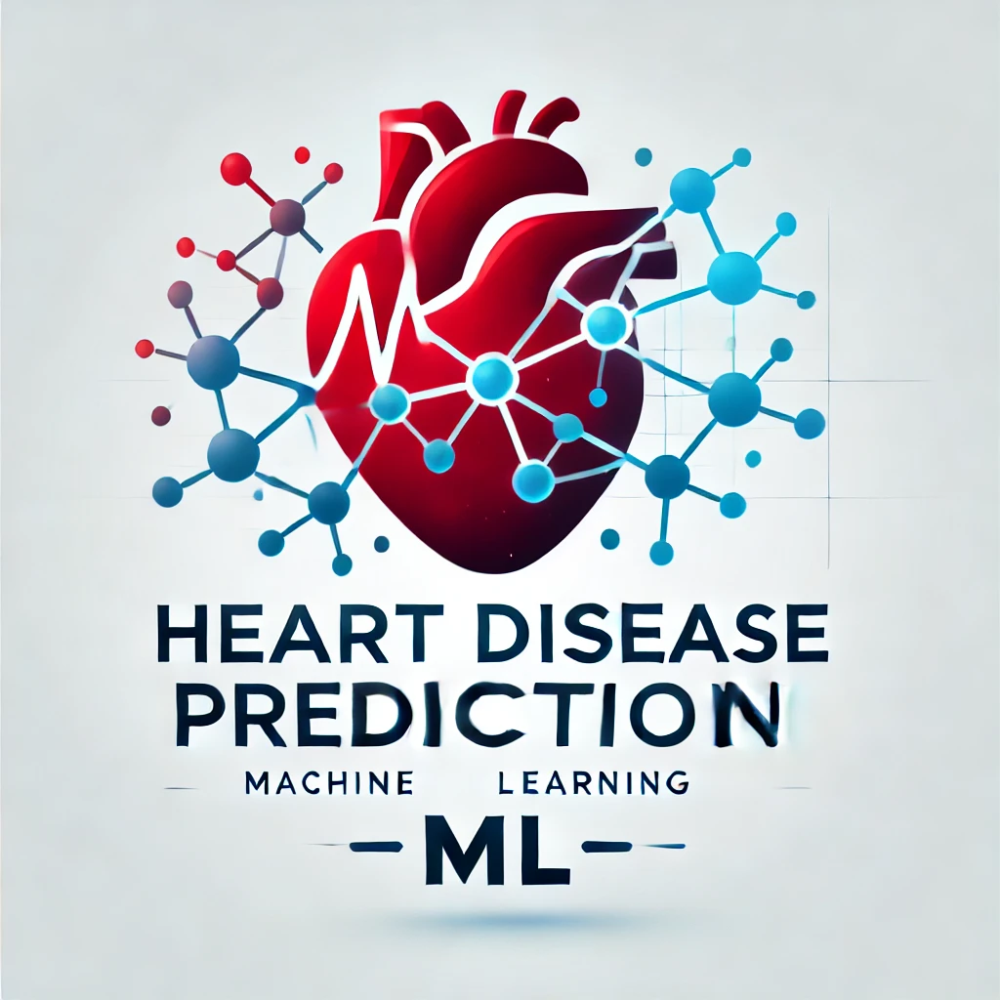
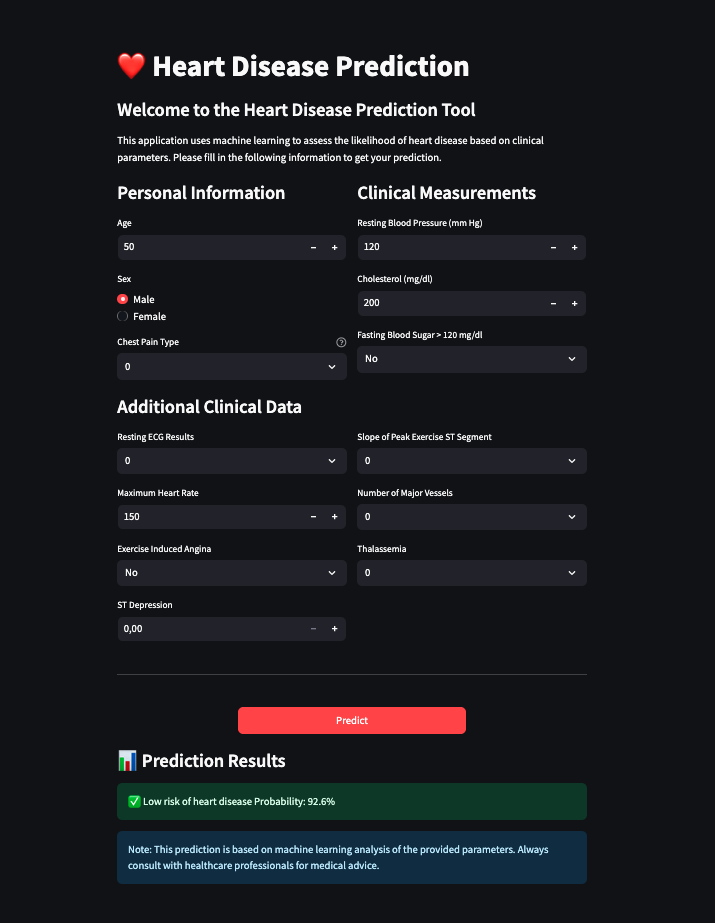

# Heart Disease Prediction ML Application



## Problem Description

This project implements a machine learning model to predict the likelihood of heart disease based on patient health metrics. The model uses various clinical parameters such as age, blood pressure, cholesterol levels, and other medical indicators to predict whether a patient has heart disease. This tool can assist healthcare professionals in preliminary risk assessment for heart disease.

### Why This Matters

Heart disease remains one of the leading causes of death globally. Early detection and risk assessment are crucial for prevention and treatment. This application provides:

- Quick preliminary risk assessment based on common health metrics
- Objective evaluation using machine learning algorithms
- Immediate results that can help prioritize further medical evaluation

### Target Users

- Healthcare professionals for initial screening
- Medical researchers for risk factor analysis
- Healthcare facilities for patient triage support

## Project Structure

- `notebook.ipynb`: Contains EDA, feature importance analysis, and model selection process
- `train.py`: Script for training and saving the final model using BentoML
- `predict.py`: Script for loading the model and serving predictions via API
- `app.py`: Streamlit web interface for making predictions

## Dataset

The project uses the UCI Heart Disease dataset, which contains the following features:

- age: Age in years
- sex: Sex (1 = male; 0 = female)
- cp: Chest pain type
- trestbps: Resting blood pressure (in mm Hg)
- chol: Serum cholesterol in mg/dl
- fbs: Fasting blood sugar > 120 mg/dl (1 = true; 0 = false)
- restecg: Resting electrocardiographic results
- thalach: Maximum heart rate achieved
- exang: Exercise induced angina (1 = yes; 0 = no)
- oldpeak: ST depression induced by exercise relative to rest
- slope: Slope of the peak exercise ST segment
- ca: Number of major vessels colored by fluoroscopy
- thal: Thalassemia type
- target: Presence of heart disease (1 = yes, 0 = no)

The dataset is automatically downloaded when running the training script.

## How to Run the Project

1. **Install dependencies:**

   ```bash
   pip install -r requirements.txt
   ```

2. **Train the model:**

   ```bash
   python train.py
   ```

   This will train the model and save it using BentoML. Note the model tag printed in the logs.

3. **Start the BentoML prediction server:**

   ```bash
   bentoml serve service:svc --reload
   ```

   This will start a local server to handle prediction requests.

4. **Run the Streamlit web interface:**
   ```bash
   streamlit run app.py
   ```
   The web interface will be available at http://localhost:8501.

## Deployment

You can access the deployed application here: [Heart Disease Prediction App](https://ml-zoomcamp-capstone.replit.app/)



## Model Details

- Algorithm: Random Forest Classifier
- Features: 13 clinical parameters
- Target: Binary classification (presence/absence of heart disease)
- Performance metrics: Available in the notebook.ipynb

## API Endpoints

POST `/predict`

- Input: JSON with patient features
- Output: Prediction (0/1) and probability score

Example:

```json
{
  "age": 50,
  "sex": 1,
  "cp": 2,
  "trestbps": 120,
  "chol": 200,
  "fbs": 0,
  "restecg": 1,
  "thalach": 150,
  "exang": 0,
  "oldpeak": 1.5,
  "slope": 2,
  "ca": 0,
  "thal": 2
}
```

## Development

The project follows ML engineering best practices:

- Extensive EDA in notebook.ipynb
- Model training pipeline with proper validation
- API serving with error handling
- User-friendly web interface
- Comprehensive documentation
