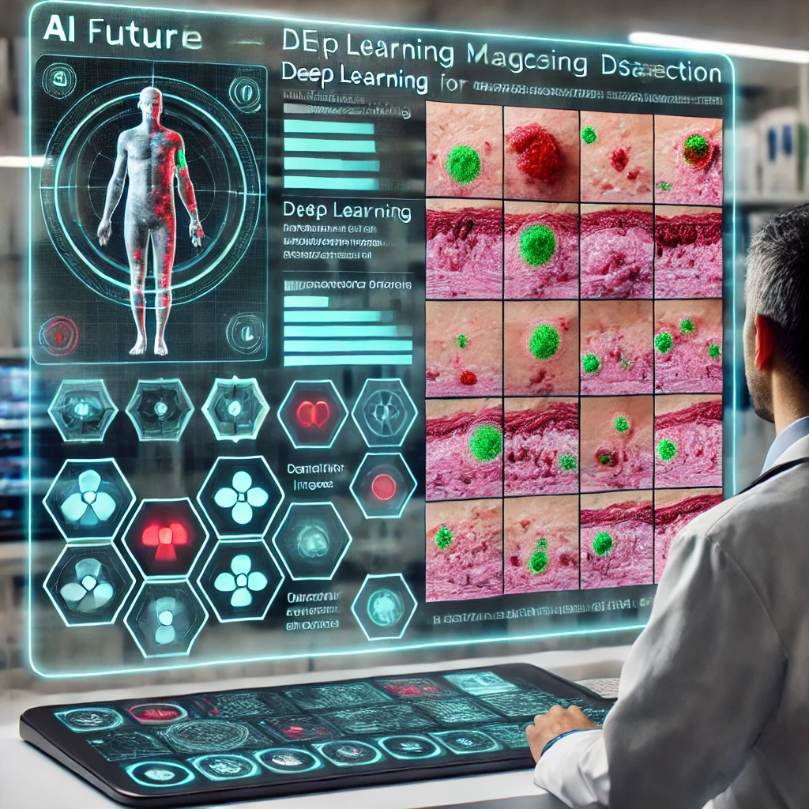
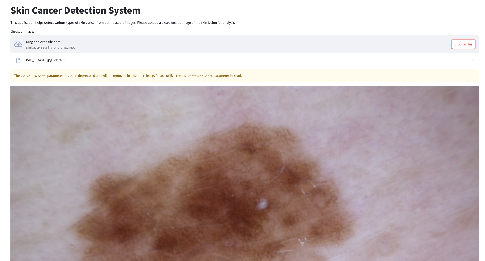
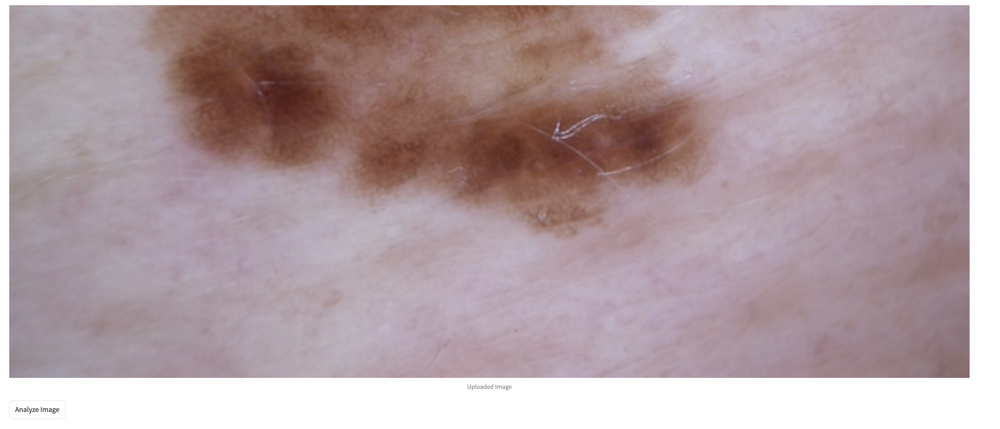
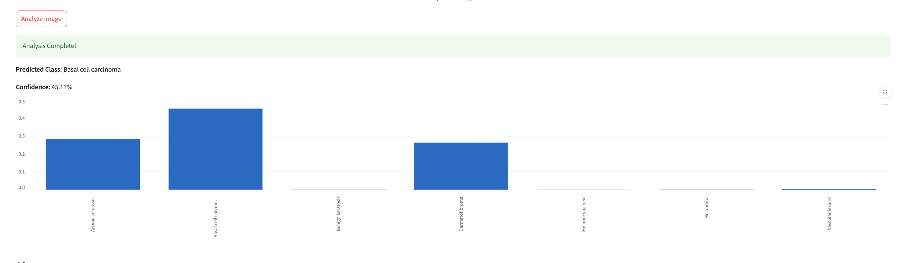

# Skin Cancer Detection System



## Overview

This project is part of the Data Talks Club Machine Learning Bootcamp Capstone Project 2. It implements a deep learning-based system for skin cancer detection using dermoscopic images. The model assists healthcare professionals by analyzing dermoscopic images and classifying them into different types of skin lesions, aiding early detection of melanoma and other forms of skin cancer.

## Features

- **Deep Learning Model**: Uses PyTorch for image classification.
- **Preprocessing Pipeline**: Efficient data processing and augmentation.
- **Streamlit Web Interface**: User-friendly interface for predictions.
- **Prediction Script**: Provides a backend service for model inference.
- **Dockerized Deployment**: Ready-to-deploy containerized solution.

## Dataset

This project utilizes the **HAM10000 dataset** ("Human Against Machine with 10000 training images").

### Download Instructions

1. Visit [HAM10000 Dataverse](https://dataverse.harvard.edu/dataset.xhtml?persistentId=doi:10.7910/DVN/DBW86T)
2. Download:
   - `HAM10000_images_part1.zip` and `HAM10000_images_part2.zip`
   - `HAM10000_metadata.csv`
3. Extract the images to `data/images/`
4. Place `HAM10000_metadata.csv` in the `data/` directory

## Installation

### Environment Setup

Ensure you have **Python 3.11+** installed. You can install dependencies with:

```bash
pip install -r requirements.txt
```

Alternatively, install using `pyproject.toml`:

```bash
pip install .
```

### Running the Application

1. Train the model:
   ```bash
   python train.py
   ```
2. Run the Streamlit web app:
   ```bash
   streamlit run app.py
   ```
3. Run the Flask API:
   ```bash
   python predict.py
   ```

## Docker Setup

To containerize the project, build and run the Docker container:

```bash
docker build -t skin-cancer-detector .
docker run -p 8501:8501 skin-cancer-detector
```

## Project Structure

```
├── data/                    # Dataset folder
├── models/                  # Saved model files
├── src/
│   ├── data_loader.py       # Data loading utilities
│   ├── preprocessing.py     # Image preprocessing steps
│   ├── model.py             # Model definition
│   ├── train.py             # Training script
├── app.py                   # Streamlit app
├── predict.py               # Prediction script
├── Dockerfile               # Containerization setup
├── pyproject.toml           # Dependency management
├── README.md                # Project documentation
```

## Deployment

[Web Deployment](https://skin-cancer-ml-abdullahisamarkus.replit.app/)

### Screenshots





## Future Improvements

- Enhance model performance with advanced architectures.
- Integrate Explainable AI (XAI) techniques.

## License

MIT License

---

_This project is developed as part of the Data Talks Club Machine Learning Bootcamp._
